# Atomic Design Concept - Ecological Succession Metaphor

This document visualizes the **Atomic Design methodology** implemented with an **Ecological Succession Metaphor** in the CheckListas UI Design System.

## 🌱 Ecological Succession Overview

```mermaid
graph TD
    subgraph "🌱 Pioneer Species (Foundation)"
        A1[Atomic Tokens<br/>Colors, Typography, Spacing]
        A2[Base Elements<br/>HTML-like Components]
    end

    subgraph "🌿 Intermediate Species (Growth)"
        B1[Components<br/>Molecule Combinations]
        B2[Widgets<br/>Organism Patterns]
    end

    subgraph "🌳 Climax Community (Maturity)"
        C1[Wireframes<br/>Template Structures]
        C2[X-Pages<br/>Complete Experiences]
    end

    A1 --> B1
    A2 --> B1
    B1 --> B2
    B2 --> C1
    C1 --> C2

    style A1 fill:#1e40af,stroke:#1d4ed8,stroke-width:3px,color:#ffffff,font-size:12px,font-weight:bold
    style A2 fill:#1e40af,stroke:#1d4ed8,stroke-width:3px,color:#ffffff,font-size:12px,font-weight:bold
    style B1 fill:#6b21a8,stroke:#7c3aed,stroke-width:3px,color:#ffffff,font-size:12px,font-weight:bold
    style B2 fill:#6b21a8,stroke:#7c3aed,stroke-width:3px,color:#ffffff,font-size:12px,font-weight:bold
    style C1 fill:#166534,stroke:#16a34a,stroke-width:3px,color:#ffffff,font-size:12px,font-weight:bold
    style C2 fill:#166534,stroke:#16a34a,stroke-width:3px,color:#ffffff,font-size:12px,font-weight:bold
```

## 🔬 Layer 1: Atomic Tokens (Pioneer) - Foundation Establishment

## 🧩 Layer 2: Base Elements (Pioneer) - Initial Colonization

## 🧪 Layer 3: Components (Intermediate) - Ecosystem Development

## 🏗️ Layer 4: Widgets (Intermediate) - Complex Organisms

## 📐 Layer 5: Wireframes (Climax) - Structural Templates

## 🎯 Layer 6: X-Pages (Climax) - Complete Experiences

## 🔄 Component Flow: Pioneer → Intermediate → Climax

## 📊 Implementation Metrics

## 🏆 Success Metrics

- **Reusability**: 85% of components reused across products
- **Consistency**: 95% adherence to design tokens
- **Maintainability**: 90% reduction in design debt
- **Developer Velocity**: 60% faster feature development
- **User Experience**: Improved consistency across touchpoints

## 🎯 Usage Guidelines

### For Designers
1. **Start with Atoms**: Always define tokens first
2. **Build Molecules**: Combine atoms into reusable components
3. **Create Organisms**: Assemble components into complex widgets
4. **Design Templates**: Structure layouts for consistency
5. **Implement Pages**: Create complete user experiences

### For Developers
1. **Use Tokens**: Always reference design tokens, never hardcode values
2. **Compose Components**: Build complex UIs from atomic building blocks
3. **Follow Naming**: Use consistent naming conventions
4. **Document Usage**: Add examples and usage guidelines
5. **Test Thoroughly**: Ensure components work across all contexts

### For Product Managers
1. **Plan Incrementally**: Build design system alongside product features
2. **Measure Impact**: Track reusability and consistency metrics
3. **Scale Gradually**: Start small, expand as needed
4. **Maintain Governance**: Establish clear ownership and maintenance processes

## 🚀 Evolution Path

The design system follows a natural maturation process:

1. **🌱 Pioneer (Months 1-3)**: Establish foundation with tokens and basic components
2. **🌿 Intermediate (Months 3-6)**: Develop complex components and patterns
3. **🌳 Climax (Months 6+)**: Mature ecosystem with complete page templates

This approach ensures sustainable growth and maintains design consistency while allowing for organic evolution based on real usage patterns and user needs.
